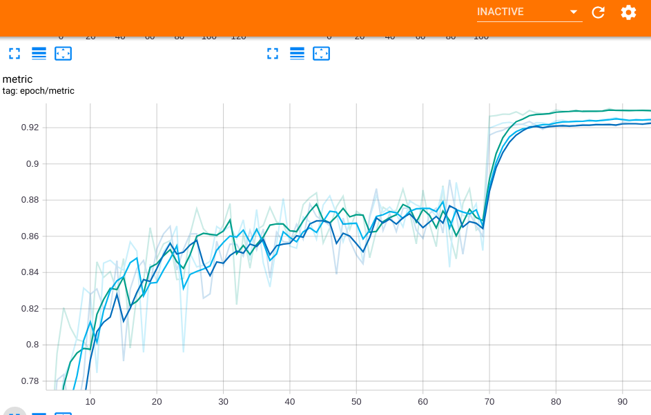

# SRM Network PyTorch
An implementation of SRM block, proposed in "SRM : A Style-based Recalibration Module for Convolutional Neural Networks".

## Requirements
- Python >= 3.6
- PyTorch >= 1.1
- torchvision
- back > 0.0.3

## Implementation notes

## Training
```bash
python cifar10_train.py --model_name srmnet
```
### Training parameters
```python
batch_size = 128
epochs_count = 100
optimizer = optim.SGD(model.parameters(), lr=0.1, momentum=0.9,
                      weight_decay=1e-4)
scheduler = MultiStepLR(optimizer, [70, 80], 0.1)
```
## Results
### Cifar10
|           |ResNet32|Se-ResNet32|SRM-ResNet32|
|:----------|:-------|:----------|:-----------|
|accuracy   |92.1%   |92.5%      |92.9%       |
|weights    |466,906 |470,266(+0.72%)|469,146(+0.48%)|


Dark blue - ResNet

Blue - Se-ResNet

Green - SRM-ResNet

